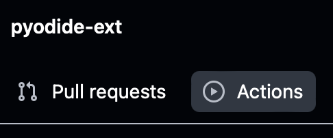
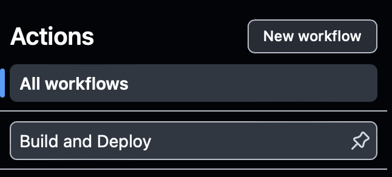
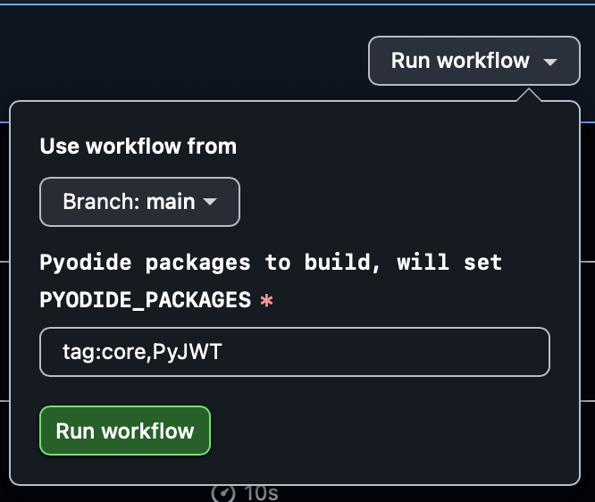

# `pyodide-ext`: Extending Pyodide

This is a [template repository](https://docs.github.com/en/repositories/creating-and-managing-repositories/creating-a-repository-from-a-template) used to create a custom [Pyodide](https://pyodide.org/) distribution with additional packages. The motivation for this is to build interactive [JupyterLite](http://jupyterlite.readthedocs.io/) sites, but this distribution can be used for whatever you need.

The base Pyodide distribution [includes over 250 pacakges](https://pyodide.org/en/stable/usage/packages-in-pyodide.html) beyond those in the [Python Standard Library](https://docs.python.org/3/library/index.html). However, your project may need packages that aren't yet available, and this repository and its documentation can help you get things working in Pyodide.

TODO: Mention something about being able to do this wihtin the free level of GitHub usage and the scaling available from GitHub Pages.

The basic steps are:
1. Create a new GitHub repository using this template. ([jump to section](#generating-a-new-repository))
1. Configure GitHub Pages to build using the [Build and Deploy](.github/workflows/deploy.yaml) workflow.
1. Add new package folders and `meta.yaml` files in the [`packages/`](./packages/) folder.
1. Check the build status in the Actions tab.
1. Test the build in the REPL console at: `https://{your-github-username}.github.io/{repo-name}/console.html`.

The [Build and Deploy](.github/workflows/deploy.yaml) workflow is derived from the Pyodide [`main`](https://github.com/pyodide/pyodide/blob/main/.github/workflows/main.yml) workflow, and currently this template is pinned Pyodide version 0.27.5. You can verify this by checking around [line 35 of Build and Deploy](.github/workflows/deploy.yaml#L35)
```yaml
      - uses: actions/checkout@v4
        with:
          repository: 'pyodide/pyodide'
          ref: '0.27.5'
          submodules: 'recursive'
```
The [Build and Deploy](.github/workflows/deploy.yaml) workflow may need be modified for future Pyodide releases.

## Generating a New Repository

These instructions apply to [`https://github.com/rpwagner/pyodide-ext`](https://github.com/rpwagner/pyodide-ext). If this is a repository generated from the original, it may not be a template, so you will need to fork it or clone it to reuse it. To generate your own repository based on this one, you can follow [GitHub's instructions](https://docs.github.com/en/repositories/creating-and-managing-repositories/creating-a-repository-from-a-template#creating-a-repository-from-a-template).

Some notes:
- Make sure you create your new repository under an account (likely your personal one) where you can enable GitHub Pages.
- You can give your new repository a different name. These instructions will assume that you named it `pyodide-ext`.

## Configure GitHub Pages

This repository uses a [GitHub Actions workflow](https://docs.github.com/en/actions/writing-workflows/about-workflows) to build a Pyodide distribution and to deploy that distribution to GitHub Pages. First, follow the GitHub instructions to enable [building the distribution using the GitHub Actions workflow](https://docs.github.com/en/pages/getting-started-with-github-pages/configuring-a-publishing-source-for-your-github-pages-site#publishing-with-a-custom-github-actions-workflow) on your new repository.

After you enable this, go to the "Actions" tab on your repository:



Click on the "Build and Deploy" button below the list of "All workflows":



On the right, click on the "Run workflow" button, and in the dropdown, click on the the next "Run workflow" button. You don't need to change any of the settings at this time.




You might find it convenient to add a link to your GitHub Pages


- update repo landing page settings to show link
- Kick off build, check the results
- Clone the repo
- Venv `python -m venv venv`, `source venv/bin/activate`
- install tools `pip install -r requirements.txt`
- add you packages starting from the bottom up so you can test them
- For each dependency create a [skeleton yaml file](https://pyodide.org/en/stable/development/new-packages.html#creating-the-meta-yaml-file)
```
pyodide skeleton pypi <package name>
```
  - update download? wheel or tarball?
  - definitely add the dependencies
  - make sure to add all the dependencies, even standard library ones
  - need this because of dynamic loading
- git add, commit, push
- you can do this through the browser if you're familiar with the meta.yaml format
- watch the build process
- can also build locally
  - more advanced process
- test by going to your repo and checking the build and deploy action status
- once it's built, go to console and run a test
  - good to test even an import to make sure dependencies were listed correctly
- need to define a way to keep the list of packages to build up-to-date
  - git commit hook?
  - '*'?
- Consider committing these packages to the list of Pyodide packages

## Testing the Pyodide Distribution


Test the build in the REPL console at: `https://{github-username}.github.io/{repo-name}/console.html`.


## Using the Pyodide Distribution


`https://{github-username}.github.io/{repo-name}/pyodide.js`


`https://{github-username}.github.io/{repo-name}/console.html`